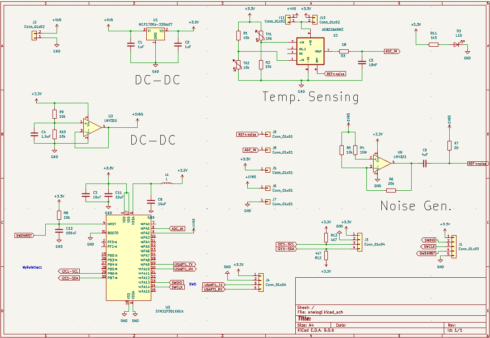
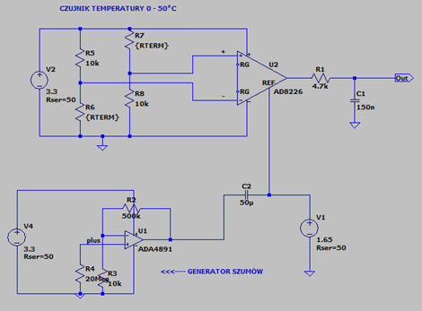
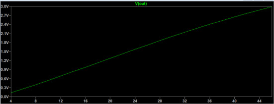
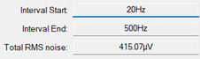
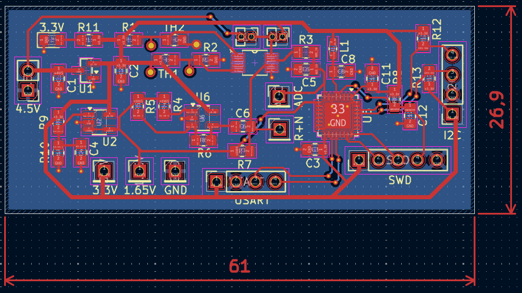
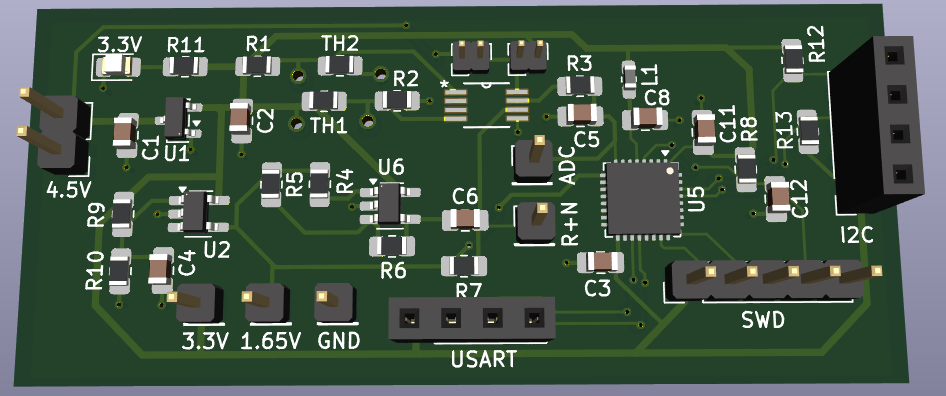
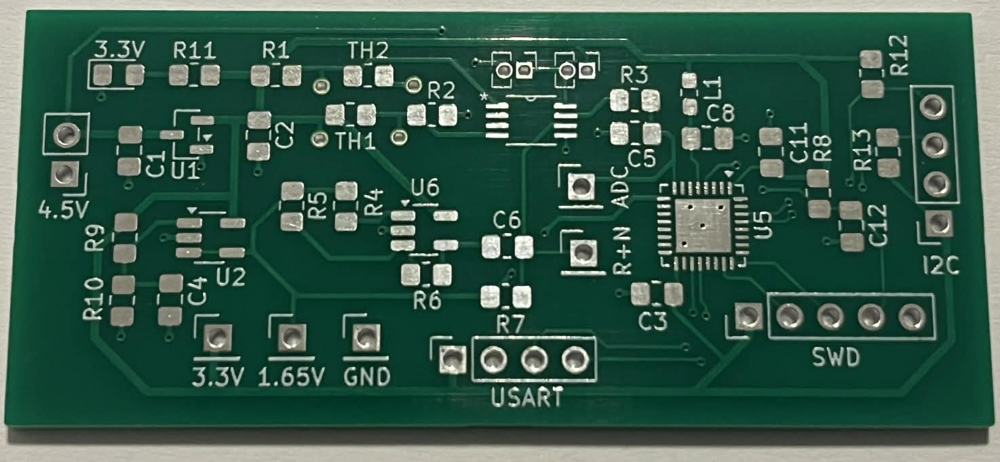
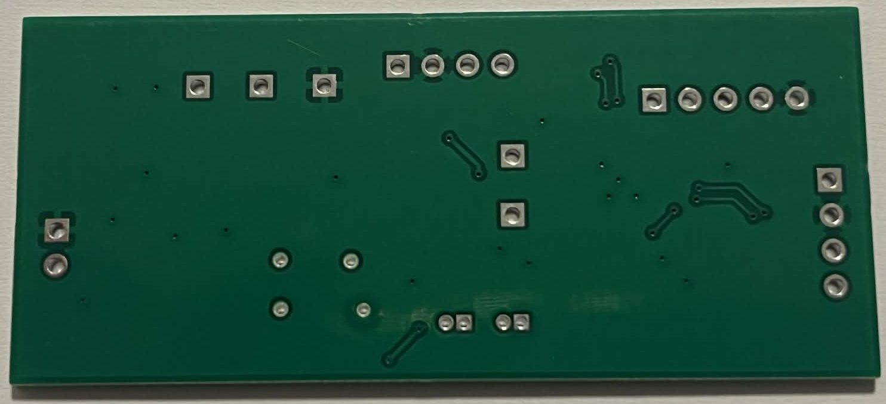

# PCB---Temperature-Measurement-Using-Oversampling-for-High-Precision
A PCB was designed to achieve high-precision temperature measurements by exploiting the thermal noise of a resistor. By combining this noise with oversampling and averaging techniques, the measurement precision is significantly enhanced.

## Project Report
### Electronics and Telecommunications
### Author: Damian Machnik
### Date: 6th January 2026

## Table of contents
1. [Project Description and Objectives](#project-description-and-objectives)
   
   1.1. [Project Goal](#project-goal)
   
   1.2. [Application](#application)

   1.3. [Symulation and design environment](#symulation-and-design-environment)
   
   1.4. [Conducted studies](#conducted-studies)
   
2. [Project results](#project-results)
   
   2.1. [Schematic](#schematic)

   2.2. [Simulatrion results](#simulatrion-results)

   2.3. [PCB design](#pcb-design)

   2.4. [Manufactured PCB](#manufactured-pcb)

3. [Current Status and Next Steps](#Current-Status-and-Next-Steps) 
   
   
  
## Project description and objectives

### Project goal
      The goal of this project was to design a high-precision temperature sensor with an integrated display. The sensor exploits the amplified thermal noise of a resistor, which is introduced into the signal from a pair of thermistors arranged in a Wheatstone bridge. By applying oversampling combined with ADC averaging, the measurement precision is significantly improved. This method is described in STMicroelectronics application note https://www.st.com/resource/en/application_note/an5537-how-to-use-adc-oversampling-techniques-to-improve-signaltonoise-ratio-on-stm32-mcus-stmicroelectronics.pdf.
   The project aimed to develop a temperature sensor capable of measuring temperatures in the range of 0–50 °C with a precision of up to 0,001 °C.

### Application
  The high-precision temperature sensor developed in this project can be applied in areas where ultra-accurate temperature measurement is critical. Potential applications include:
Laboratory instrumentation – precise monitoring of environmental or sample temperatures.
Calibration and metrology – as a reference sensor for calibrating other temperature-measuring devices.
Medical equipment – monitoring temperatures in devices where small variations can impact results.
Industrial process control – for processes requiring tight temperature tolerances, such as chemical reactions or semiconductor manufacturing.

### Symulation and design environment
Simulations were performed in LTSpice to analyze the circuit and select appropriate components to achieve the project’s design goals. A series of simulations were conducted for each subcircuit individually for component calibration, as well as for the complete system to verify overall performance.
The PCB was designed in KiCad 9.0, where the schematic was created from scratch and the components were placed and routed on the PCB layout.

## Project results

### Schematic
The components were selected to meet the project requirements while minimizing overall cost. The only exception is the STM32F301K6 microcontroller, which was chosen for its high sampling frequency of 5 MHz, essential for achieving the desired measurement precision.

### Simulatrion results
The figures illustrate the simulated circuit and the corresponding output voltage as a function of temperature.

### PCB design

### Manufactured PCB

## Current Status and Next Steps
At present, the components are being soldered onto the PCB. In the next stage, tests will be conducted to verify the operation of the circuit.

